# Week01 UNIX

### [Assignment 0](https://github.com/tamucc-comp-bio-2020/classroom_repo/blob/master/assignments/assignment_0.md) is due at the beginning of this lecture

## [Lecture 01 Slides](Week01_files/Lecture01_WelcomeToTheMatrix.pdf)

## Computer Preparation

You are expected to start each lecture with your terminal window open and ready to go.

<details><summary>Win10</summary>
<p>

  * If the Ubuntu app is not installed, then follow [these instructions](https://github.com/cbirdlab/wlsUBUNTU_settings/blob/master/InstallLinuxOnWindows_Automated.pdf)
  
  * Log into your Ubuntu terminal.  _We will not use `gitbash` unless you can't get Ubuntu running._ After logging in, You are in your home directory. 
  
  * If you are using an Ubuntu terminal that hasn't been setup (you'll know because it will ask you to create a new user name and password) or you notice odd cursor behavior when editing text in the terminal, then run the following code:
  
    ```bash
    git clone https://github.com/cbirdlab/wlsUBUNTU_settings.git
    . ./wlsUBUNTU_settings/updateSettings.bash
    rm -rf wlsUBUNTU_settings
    ```
    
  * If the `CSB` directory does not exist in your home directory (check with `ls`), then run the following code to clone the `CSB` repository into your home directory:
  
    ```bash
    git clone https://github.com/CSB-book/CSB.git
    ```

  * It's always a good idea to keep your apps in `Ubuntu` up to date. _The first time you do this, it could take a long time to finish. After that, if you do this when you log in, it should go quickly._
    ```bash
    sudo apt update
    sudo apt upgrade
    ```

</p>
</details>

<details><summary>MacOS</summary>
<p>
 
  * Open a terminal window
  
  * Consider installing [homebrew](https://brew.sh/).  You will be able to use homebrew to install linux software, such as `tree`, which is used in the slide show.
  
  * If the `CSB` directory does not exist in your home directory (check with `ls`), then run the following code to clone the `CSB` repository into your home directory:
  
    ```bash
    git clone https://github.com/CSB-book/CSB.git
    ```
    
</p>
</details>


## Text Book Vs. Lecture Slides

<details><summary> </summary>
<p>

* The [**Lecture_01 Slides**](Week01_files/Lecture01_WelcomeToTheMatrix.pdf) closely follow the book but there is some additional information that is not provided in the book (and vice versa). In the lecture slides, the `code blocks` are represented by green text on a black background, mimicking the terminal.

</p>
</details>


## Lecture: Unix, Linux, & CLI

For the online version of this course, I am converting the ppt slides to a more screen-splitting friendly format here in GitHub.

<details><summary>Introduction</summary>
<p>

### [Linux](https://en.wikipedia.org/wiki/Linux) is a Free & Open Source Version of the [UNIX](https://en.wikipedia.org/wiki/Unix) Operating System


* An [operating system](https://en.wikipedia.org/wiki/Operating_system) is the primary interface between you and the computer

* [Open source](https://en.wikipedia.org/wiki/Open_source) is a decentralized development model where all aspects of a project are viewable and generally free to use

* Linux is free

  * [Supercomputers](https://en.wikipedia.org/wiki/Supercomputer) typically use it

  * Useful text manipulation tools

---

### The 2 Primary Methods of Interfacing with Computers

#### 1. Graphical User Interface ([GUI](https://en.wikipedia.org/wiki/Graphical_user_interface))

A mouse or you finger is used to interface with images on a screen.


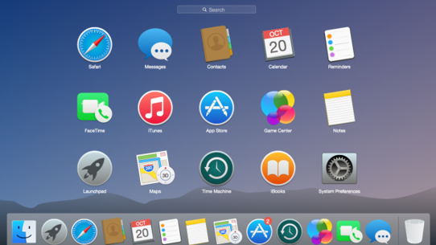


#### 2. Command-line Interface ([CLI](https://en.wikipedia.org/wiki/Command-line_interface))

A keyboard is used to type commands into the computer and computer gives feedback on the screen.


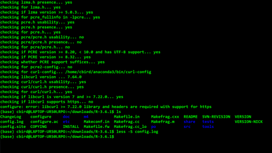

---

### Why use CLI Linux?


* Free

* Automation

* Flexibility

* Powerful

* Designed for developers

* Supercomputers use it

* Many software tools for biologists

* Large body of support online

---

### The [UNIX Philosophy](https://en.wikipedia.org/wiki/Unix_philosophy)


* One program ([command](https://en.wikipedia.org/wiki/List_of_Unix_commands)) does one thing

* All programs accept input as a text stream and output a modified [text stream](https://en.wikipedia.org/wiki/Standard_streams)

* Programs can be linked together into serial [pipelines](https://en.wikipedia.org/wiki/Pipeline_(Unix)) to achieve complex results

---

### Documentation of Linux CLI Pipelines Facilitate Scientific Reproducibility and Long-Term Efficiency

Comparison of GUI and CLI for manipulating data


---


</p>
</details>

<details><summary>Interactive Session: Getting Started with Unix</summary>
<p>

### Open A Terminal Window

WIN10:  Search Ubuntu


MacOS: Search Terminal

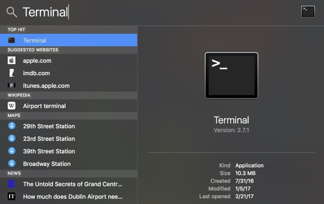

---

### The [Directory Structure](https://en.wikipedia.org/wiki/Directory_structure) is the Organization of Files and Folders (aka Directories) In Your Computer

WIN10 File Explorer

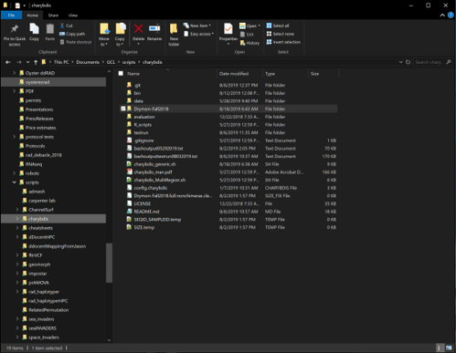

Ubuntu Terminal

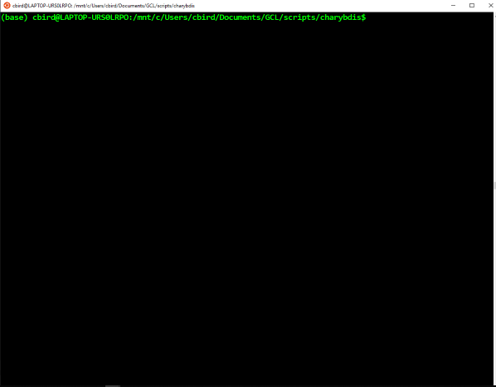

The CLI forces you to start memorizing where your files are and what they are named. This causes 95% of the difficulties in learning CLI, so start memorizing to your directory structure.  It is also a good idea to be deliberate and organized when creating new directories and files.

We will use [code blocks](https://en.wikipedia.org/wiki/Block_(programming)) to let you know when and what to type into your CLI. Here, please enter the commands `pwd` and then `ls` into your terminal.

```bash
pwd
ls
```

`pwd` lists the present working directory

`ls` lists the contents of the present working directory

Pro tip: clear the screen with `ctrl + L` keystroke

---

### Unix/Linux Command Line Terminology

The [path](https://en.wikipedia.org/wiki/Path_(computing)) is the address of a file or directory in the directory structure

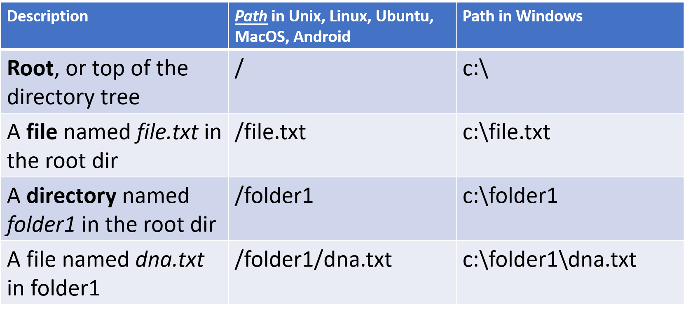

---

### Some Notable Directories (do not modify files here)

`/bin` contains several basic commands

`/dev` Contains the files connecting to devices such as the keyboard, mouse, and screen

`/etc`Contains configuration files

`/tmp` Contains temporary files

Try using `ls` to view these directories

```bash
ls /bin
ls /dev
ls /etc
ls /tmp
```

---

### Your Home Directory

`/home/<username>` is the directory where you are expected to create and maintain your directories and files.

  * Note that `<username>` is a place holder for your username on your computer
  
  * Starting directory upon login

  * Specific to user

  * Place for personal files, dirs, programs, downloads etc

`$HOME` is a [variable](https://en.wikipedia.org/wiki/Variable_(computer_science)) that contains the path to your home directory

  * A variable stores information

  * Always preceded by a `$` after it is created

  * `$HOME` is an environmental variable created by the operating system and `bash`
  
  * a shortcut for `$HOME` is the `~` character located at the upper left of your keyboard

```bash
echo $HOME
pwd
ls
ls $HOME
ls ~
```

---

### The Directory Tree


The directory tree is a map of the directories and files on your computers hard drives and/or solid state drives

If you have Ubuntu or a Mac with `homebrew` or some other linux package manger, you can install `tree` to view portions of your directory tree in "tree" format.

```bash
# this is a comment, as indicated by the # at the beginning of the line.  Do not type it into your terminal
# Ubuntu Only
sudo apt install tree

# Mac with homebrew only
brew install tree
```

We just installed the `tree` command (or app) from the internet to your computer.  If you were not able to do this because you did not install `homebrew` on your mac, it is ok. `tree` is not a critical command

```bash
# this will only work if you have tree installed, it is just an example so do not worry if you do not have it
cd ~
tree CSB
tree -L 1 CSB
tree -L 2 CSB
man tree
```

The `man` command is nearly universal in displaying the manual for "commands" such as `tree`. Use the `q` keystroke to exit the manual for tree.

---

### The `CSB/unix` [Repository](https://en.wikipedia.org/wiki/Repository_(version_control))

Our primary text book, [Computing Skills for Biologists](https://computingskillsforbiologists.com/), provides a rich assortment of resources for you.  Most of these resources are contained in a GitHub repository that you have cloned into your home directory.  This is the `CSB` directory. 

The `CSB` directory is organized by topic, with subdirectories dedicated to different chapters.  The directory for chapter 1 is `CSB/unix`.

`CSB/unix/data` Contains data for examples and exercises

`CSB/unix/installation` Contains instructions for installing software for this chapter

`CSB/unix/sandbox` Dir where we work and experiment

`CSB/unix/solutions` Solutions in code (`bash`) pseudocode (plain English) for your consultation when you get stuck with an exercise

```bash
# I am adding the 'cd ~' command to make sure you are in your home dir before running the 'ls' commands
cd ~
ls CSB/unix/
ls CSB/unix/data
ls CSB/unix/installation
ls CSB/unix/sandbox
ls CSB/unix/solutions
```

---

</p>
</details>

<details><summary>Interactive Session: The Shell</summary>
<p>

### The [Shell](https://en.wikipedia.org/wiki/Shell_(computing))

* The shell is software that controls the [operating system kernel](https://en.wikipedia.org/wiki/Kernel_(operating_system)) and is accessed through a terminal window

* The shell we are using in Ubuntu and MacOS is called `bash`, or Born Again Shell

* `bash` is a [shell scripting](https://en.wikipedia.org/wiki/Shell_script) computer language

* The commands we have been using are `bash` commands which allow us to control the operating system

The image below shows the [command prompt](https://en.wikipedia.org/wiki/Command-line_interface#Command_prompt) on my computer. Below the picture, we decode some of the information for you.


`$` Indicates the terminal is ready  to accept commands

`~` Indicates where I am, the home dir

`LAPTOP-URSOLRPO` is the name of my laptop (very creative, am I right?!)

`cbird` is my user name

The rest is not important right now, but if you are dying to know, the `(base)` is there because I have [anaconda](https://www.anaconda.com/) running to manage [python](https://en.wikipedia.org/wiki/Python_(programming_language)). If I turn off anaconda, then the `(base)` will go away.

---

### Bash Keyboard Shortcuts

*`↑`*	Scroll through previous commands

*`Tab`*	autocomplete command, dir, or file name. if you hit tab and nothing happens there are either multiple matches or 0 matches

*`Tab,Tab`*	 show matches

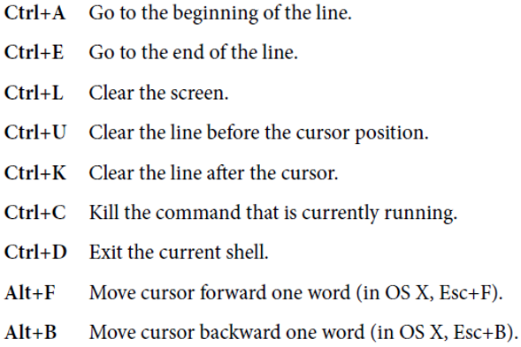

Go ahead and try some of these in your terminal. 

Note that I have created a [Linux Cheat Sheet](https://github.com/tamucc-comp-bio-2020/classroom_repo/blob/master/resources/CheatSheetLinux_8-12-2016.pdf) to help you with common `bash` commands and keyboard shortcuts.  I encourage you to print this out on a single sheet of paper, both sides, for your reference.

---

### `bash` Command Syntax

```bash
# be sure to type the following commands into your terminal, but not this message
cal
cal 2020
cal -j
cal -j 2020
```

_Note: `ctrl + c` will stop a command if it is taking too long to complete_

* Bash _*commands*_ like `cal` are programs that follow the UNIX philosophy.

* _*Arguments*_ like `2020` are essentially options, order usually matters and some commands require particular arguments. For example, `cp` or copy requires at least which file to copy and where to copy it, in that order

* `-j` is an _*option*_, in this case it means Julian calendar

  * if an option is preceded by a single `-`, it is customary for that option to be represented by a single letter.  If an option is preceded by two dashes `--julian` it is typically a word.  In this case, `cal` has been updated and all word options have been removed, so `--julian` is no longer recognized.  Realize that it is up to the developer ( the person who writes the software ) to enforce formats, so you will find commands that do not follow convention as you get into more "boutique" commands and apps.

---

### Getting Help with `bash`

#### 1. Use an internet search with your favorite search engine if you know what you want to do, but do not know the command

Example search terms: `bash <english description of what you want to do>`

Do not be afraid to modify and try different english descriptions if you do not succeed in the first search


#### 2. Use the `man` command if you know the command but are not sure of the options and arguments

```bash
man cal
```  

_scroll with arrow keys and `q` will get you out of the manual_

All manuals in unix/linux follow the same format:

`NAME`
` <name and brief descrip>`
 
`SYNOPSIS`
` <examples of how to run>`
 
`DESCRIPTION`
` <detailed description>`
` <list of arguments/options>`

---

### Changing and Viewing Directories (`cd` `pwd` `ls`)

```
# move up to parent directory
cd ..

# show path to present working directory
pwd

# move to root dir
cd /
pwd

# go back to previous dir
cd -
pwd

# go to the home dir
cd ~
pwd

# show present working dir contents
ls

# show dir contents with more details
ls -l

# show dir contents with more details, sorted by *t*ime in *r*everse order with *h*uman readable file sizes.
ls -ltrh
```

_Note:  single letter options can typically be combined together, `-l –t –r -h`  =  `-ltrh`_


The command `ls -ltrh` outputs a lot of information to the screen.  It can be overwhelming at first, but it is just basic information about your files and directories in the `pwd`

In the following image, dirs are highlighted, files are not

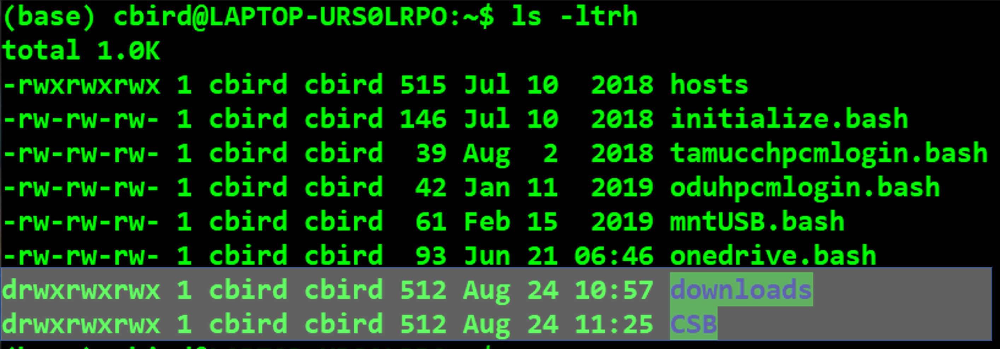

In the following image, the highlighted columns of information are as follows:

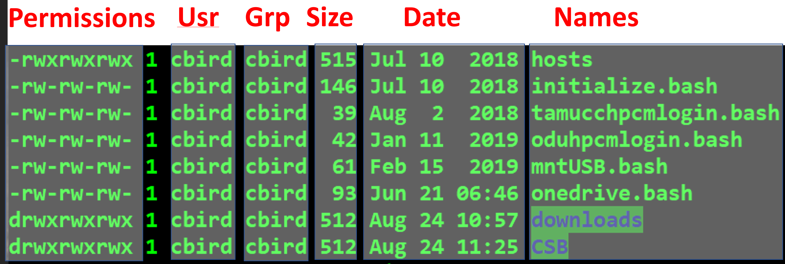

And the permissions can be further broken down.  The first column indicates whether it is a file or a directory. The 2nd to 4th columns are the User permissions.  Each user belongs to a group, which has its own set of permissions. Last, there are permissions for all users regardless of affiliation (global)

* `r` read permissions gives one the ability to view the contents of a file

* `w` write permissions gives one the ability to modify a file

* `x` execute permissions gives one the ability to run a file if it is written in computer code

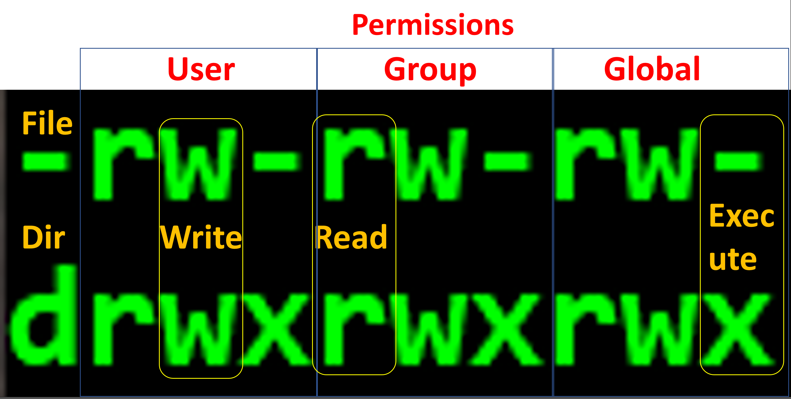

---

### Paths

A _*path*_ is the address of file or directory

An _*[absolute path](https://en.wikipedia.org/wiki/Path_(computing)#Absolute_and_relative_paths)*_ is complete and starts with root `/` or a variable that starts with root.  For example, the following return the same result regardless of pwd

```bash
# absolute paths, make sure you replace <username> with your user name
ls /home/<username>/CSB
ls ~/CSB
ls $HOME/CSB
```

_*[Relative paths](https://en.wikipedia.org/wiki/Path_(computing)#Absolute_and_relative_paths)*_ start from the present working directory

```bash
# These relative paths only work if you are in the right dir
ls ./CSB
ls CSB
ls ../
```

  * `.` Means present directory
  * `..` means  parent directory

It is best not to used spaces in dir and file names, but you can wrap file names with spaces in quotes or precede each space with a ` \ ` see pg 21 of CSB text for dealing w/ spaces


---

</p>
</details>


<details><summary>Intermezzo/Mind Expander 1.1</summary>
<p>

### [Mind Expander 1.1](https://forms.office.com/Pages/ResponsePage.aspx?id=8frLNKZngUepylFOslULZlFZdbyVx8RLiPt1GobhHnlUM1FFUUZLT01LR0ZGODU2WVNSV1c0NEpWMi4u)

</p>
</details>


<details><summary>Interactive Session: Commands to Remember</summary>
<p>

### Copy with `cp <from> <to>`

From here forward, we will adopt the code block syntax used in the CSB text book.  The `$` represents the command prompt and you are expected to type in the commands that follow it, but _*do not start any command with the `$`*_.

```bash
# goto sandbox
$ cd ~/CSB/unix/sandbox

# copy the following file to the present directory
$ cp ../data/Buzzard2015_about.txt .

# copy file and rename it in present dir
$ cp ../data/Buzzard2015_about.txt ./Buzzard2015_about2.txt

# copy whole data dir to present dir, then view present dir
$ cp –rf ../data .

$ ls
```

_Note:  `-r` means [recursive](https://en.wikipedia.org/wiki/Recursion_(computer_science)), `-f` means force_

---

### Move or rename with `mv <from> <to>`

```bash
# make sure you are still in sandbox, if not then 
$ cd ~/CSB/unix/sandbox
$ pwd

# move the file to the data directory
$ mv Buzzard2015_about2.txt ../data

# rename a file that isn’t in your pwd
$ mv ../data/Buzzard2015_about2.txt ../data/Buzzard2015_about_new.txt 

# check your work
$ ls ../data

```

_Note:  `bash` gives no positive feedback, only negative if something is wrong.  I will do my best to make up for the callousness of `bash`_


---

### Create file with touch <filename>

```bash
# make sure you are still in sandbox, if not then 
$ cd ~/CSB/unix/sandbox
$ pwd

# inspect the current contents of the directory
$ ls -l

# create a new file (you can list multiple files)
$ touch new_file.txt

# inspect the contents of the directory again
$ ls -l

# if you touch the file a second time, the time of last access will change
$ touch new_file.txt
$ ls -l

```

_Note:  `bash` gives no positive feedback, only negative if something is wrong.  I will do my best to make up for the callousness of `bash`_

---

### Remove file(s) or dir(s) with `rm <name>` 
### Make dirs with `mkdir <name>`

```bash
# make sure you are still in sandbox, if not then 
$ cd ~/CSB/unix/sandbox
$ pwd

# delete new_file.txt in sandbox, the –i requests confirmation
$ rm -i new_file.txt

# make dir d1 in present dir, d2 in d1, and d3 in d2; if you have tree try it
$ mkdir -p d1/d2/d3
$ tree d1
d1
└── d2
    └── d3

# remove the d1,d2,& d3 dirs recursively
$ rm -rf d1
```

_be careful with rm, you could delete your whole computer and there is no undo_

---

### View large files with `less -S <filename>`
### Print and concatenate files `cat <filename>`
### Print and sort files `sort <filename>`


```bash
# move to the data dir
$ cd ~/CSB/unix/data

# look at DNA alignment file, try duckduckgo search on “bash less commands”
$ less –S Marra2014_data.fasta

# type /ATCG inside of less to search; u=up, d=down, G=end, g=begin, q=exit

# concatenate files and/or print to screen
$ cat Marra2014_about.txt Gesquiere2011_about.txt Buzzard2015_about.txt

# print the sorted lines of a file
$ sort Gesquiere2011_data.csv

# sort numerically by column 2 in reverse order and view in less
$ sort –n –k2 –r Gesquiere2011_data.csv | less
```

_Note: in the last command we used a pipe `|` to direct the text stream from `sort` to `less`.  Remember the [Unix Philosophy](https://en.wikipedia.org/wiki/Unix_philosophy)_

---

### Count words with		`wc <filename>`
### Determine file type		`file <filename>`

```bash
# count lines, words, and characters
$ wc Gesquiere2011_about.txt

# count lines only
$ wc -l Marra2014_about.txt

# determine file type, ASCII is a type of human-readable text file
$ file Marra2014_about.txt
Marra2014_about.txt: ASCII English text

```

_Do not forget to use `Tab` key to autocomplete directory names and prevent spelling mistakes_

---

### Retrieve beginning of file `head –n <number of lines> <filename>`
### Retrieve end of file tail `–n <number of lines> <filename>`

```bash
# display first two lines of a file
$ head -n 2 Gesquiere2011_data.csv

# display last two lines of file
$ tail -n 2 Gesquiere2011_data.csv

# display from line 2 onward
# (i.e., removing the header of the file)
$ tail -n +2 Gesquiere2011_data.csv

# display all but the last line
$ head -n -1 Gesquiere2011_data.csv
```

_Do not forget to use `Tab` key to autocomplete file names and prevent spelling mistakes_

---

</p>
</details>


<details><summary>Intermezzo/Mind Expander 1.2</summary>
<p>

### [Mind Expander 1.2](https://forms.office.com/Pages/ResponsePage.aspx?id=8frLNKZngUepylFOslULZlFZdbyVx8RLiPt1GobhHnlUM0VSMlJZMFg2VzlNNjZVUTJINk9TRlBSOC4u)

</p>
</details>


<details><summary>Interactive Session: Advanced `bash` Commands</summary>
<p>

### Redirection of output ([stdout](https://en.wikipedia.org/wiki/Standard_streams#Standard_output_(stdout))) to file `[command] > filename`
### Append [stdout](https://en.wikipedia.org/wiki/Standard_streams#Standard_output_(stdout)) to file `[command] >> filename` 
### Redirect contents of file to [stdin](https://en.wikipedia.org/wiki/Standard_streams#Standard_input_(stdin)) `[command] < filename` 

```bash
# let’s start by moving to our sandbox
$ cd ~/CSB/unix/sandbox

# print text to screen, then print to file, then print file to screen
$ echo "My first line" 
My first line

$ echo "My first line" > test.txt
$ cat test.txt
My first line

# append file with additional text, then print file to screen
$ echo "My second line" >> test.txt
$ cat test.txt
My first line
My second line
```


_use `Tab` key to autocomplete names, prevent spelling mistakes_

---

### Problem Solving Scenario

A machine provides you with thousands of data files. There’s so many, it is breaking your file browser. How many files are there?

We will use the dir `unix/data/Saavedra2013` as an example of a directory with many files

```bash
# start by moving to our sandbox if you are not already there
$ cd ~/CSB/unix/sandbox

# save file names to file in pwd
$ ls ../data/Saavedra2013 > filelist.txt

# look at the file
$ cat filelist.txt

# count lines in the file
$ wc -l filelist.txt

# remove the file
$ rm filelist.txt
```

---

### Piping Text Streams From One Command to the Next with `|`


A pipe `|` passes the [stdout](https://en.wikipedia.org/wiki/Standard_streams#Standard_output_(stdout)) from one command to the [stdin](https://en.wikipedia.org/wiki/Standard_streams#Standard_input_(stdin)) of another

How many files are there?

```bash
# list file names
$ ls ../data/Saavedra2013

# list file names and pipe into wc
$ ls ../data/Saavedra2013 | wc –l
59

```

---

### [TSV](https://en.wikipedia.org/wiki/Tab-separated_values) & [CSV](https://en.wikipedia.org/wiki/Comma-separated_values) Data Files

In the tidy table below, columns are _*delimited*_ by tabs.  The first column has no column header but is the sample ID.  Ozone, Solar.R, Wind, Temp, Month, and Day are all pieces of data (dimensions) describing each of the 10 samples.

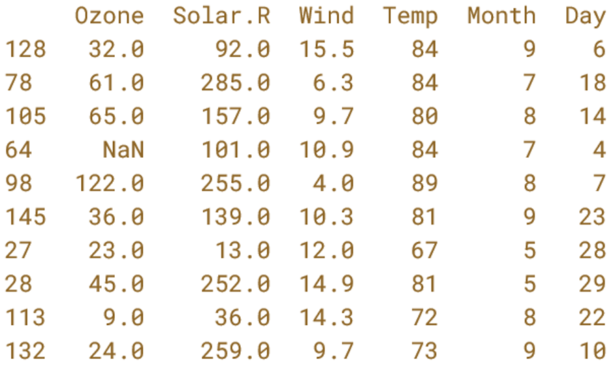

* Tab Separated Values (TSV)

  * Tabs denote columns

* Comma Separated Values (CSV)

  * Commas denote columns
  
* [Tidy data](https://en.wikipedia.org/wiki/Tidy_data)

  * Each [row](https://en.wikipedia.org/wiki/Row_(database)) is one [unit of observation](https://en.wikipedia.org/wiki/Unit_of_observation)
  
  * Each [column](https://en.wikipedia.org/wiki/Column_(database)) is one dimension or aspect of the units of observation
  
* File extensions not always accurate, so it is important to view a file to be sure of the delimiter.

Do not type in the following code blocks.  They are here to show you TSV and CSV formatting


Tidy Table:
| Column 1 Header | Column 2 Header | Column 3 Header |
| --------------- | --------------- | --------------- |
| Row 1 Column 1 | Row 1 Column 2 | Row 1 Column 3 |
| Row 2 Column 1 | Row 2 Column 2 | Row 2 Column 3 |
| Row 3 Column 1 | Row 3 Column 2 | Row 3 Column 3 |
| Row 4 Column 1 | Row 4 Column 2 | Row 4 Column 3 |

TSV
```
Column 1 Header	Column 2 Header	Column 3 Header
Row 1 Column 1	Row 1 Column 2	Row 1 Column 3
Row 2 Column 1	Row 2 Column 2	Row 2 Column 3
Row 3 Column 1	Row 3 Column 2	Row 3 Column 3
Row 4 Column 1	Row 4 Column 2	Row 4 Column 3
```

TSV File with tabs denoted by `\t`.  Note your text files will not contain `\t`.  I did this show where tabs were, versus spaces.
```
Column 1 Header\tColumn 2 Header\tColumn 3 Header
Row 1 Column 1\tRow 1 Column 2\tRow 1 Column 3
Row 2 Column 1\tRow 2 Column 2\tRow 2 Column 3
Row 3 Column 1\tRow 3 Column 2\tRow 3 Column 3
Row 4 Column 1\tRow 4 Column 2\tRow 4 Column 3
```

CSV
```
Column 1 Header, Column 2 Header, Column 3 Header
Row 1 Column 1, Row 1 Column 2, Row 1 Column 3
Row 2 Column 1, Row 2 Column 2, Row 2 Column 3
Row 3 Column 1, Row 3 Column 2, Row 3 Column 3
Row 4 Column 1, Row 4 Column 2, Row 4 Column 3
```


---

### Convert Among Formats Using `tr "<old delimiter>" "<new delimiter>"`

```bash
# view contents of csv
$ less -S ../data/Pacifici2013_data.csv 

# replace semicolons with commas using tr [find] [replace]
$ cat ../data/Pacifici2013_data.csv | tr “;” “,” | less –S

# view as tsv
# \t is the nearly universal symbol for tab
$ cat ../data/Pacifici2013_data.csv | tr ";" "\t" | less -S

```

_`tr` is an abbreviation for translate_

---

### Using `cut` to retrieve columns and `head` to retrieve rows

```bash
# change directory
$ cd ~/CSB/unix/data

# display first line of file (i.e., header of CSV file)
$ head -n 1 Pacifici2013_data.csv

# display first column of file
$ cut -d ";" –f 1 Pacifici2013_data.csv

# display second through fourth columns
$ cut -d ";" -f 2-4 Pacifici2013_data.csv

# display first “cell” of data
$ head -n 1 Pacifici2013_data.csv | cut -d ";" -f 1

```

_Note: cut assumes tab delimited files.  If a different delimiter is used in the file, the `-d` option is used to specify the delimiter.  It is very easy to mistake spaces for tabs, and that will make `cut` do odd things with your data if you do not set `-d " "`_

---

### Connecting `cut` `head` `tail` `sort` `uniq`

```bash
# select 2nd column, display first 5 elements
$ cut -d ";" -f 2 Pacifici2013_data.csv | head -n 5

# select 2nd and 8th columns, display first 3 elements
$ cut -d ";" -f 2,8 Pacifici2013_data.csv | head -n 3

# select 2nd column without header, show 5 first elements
$ cut -d ";" -f 2 Pacifici2013_data.csv | tail -n +2 | head -n 5

# identify the orders in csv
# select 2nd column without header, unique sorted elements
$ cut -d ";" -f 2 Pacifici2013_data.csv | tail -n +2 | sort | uniq

# count how many records per order in csv
$ cut -d ";" -f 2 Pacifici2013_data.csv | tail -n +2 | sort | uniq -c

```

_Note: `uniq` is a command that that removes consecutive duplicate lines (rows). For this reason, the input to `uniq` is almost always sorted beforehand.  Use `man uniq` to see the description of the `-c` option.  I use `uniq -c` all the time._

_Note: `sort -t";"` specifies the delimiter character, also known as a field separator.  Try `man sort` and search `/field` to see the manual entry for this.

---

</p>
</details>


## Homework
* [Assignment_1, Due 09/04](https://github.com/tamucc-comp-bio-2020/classroom_repo/blob/master/assignments/assignment_1.md)
* [Graduate Student Course Project Ideas, Due 09/04](https://forms.office.com/Pages/ResponsePage.aspx?id=8frLNKZngUepylFOslULZlFZdbyVx8RLiPt1GobhHnlUOUo2UVRUMVgwTUlQMlpUQzUzOTIzME9LNi4u)


