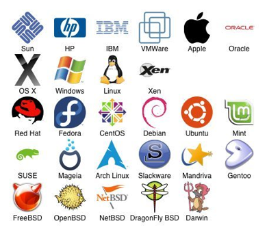

# Week02 UNIX II

# DOCUMENT & LINKS NOT YET UPDATED FOR FALL 2020

### [Assignment 1](https://github.com/tamucc-comp-bio-2020/classroom_repo/blob/master/assignments/assignment_1.md) is due at the beginning of this lecture

## [Lecture 02 Slides](Week02_files/Lecture02_WelcomeToTheMatrix.pdf)

## Computer Preparation
You are expected to start each lecture with your terminal window open and ready to go.

<details><summary>Win10</summary>
<p>

  * If the Ubuntu app is not installed, then follow [these instructions](https://github.com/cbirdlab/wlsUBUNTU_settings/blob/master/InstallLinuxOnWindows_Automated.pdf)
  
  * Log into your Ubuntu terminal.  _We will not use `gitbash` unless you can not get Ubuntu running._ After logging in, You are in your home directory. 
  
  * If you are using an Ubuntu terminal that hasn't been setup (you'll know because it will ask you to create a new user name and password) or you notice odd cursor behavior when editing text in the terminal, then run the following code:
  
    ```bash
    git clone https://github.com/cbirdlab/wlsUBUNTU_settings.git
    . ./wlsUBUNTU_settings/updateSettings.bash
    rm -rf wlsUBUNTU_settings
    ```
    
  * If the `CSB` directory does not exist in your home directory (check with `ls`), then run the following code to clone the `CSB` repository into your home directory:
  
    ```bash
    git clone https://github.com/CSB-book/CSB.git
    ```

  * It is always a good idea to keep your apps in `Ubuntu` up to date. _The first time you do this, it could take a long time to finish. After that, if you do this when you log in, it should go quickly._
    ```bash
    sudo apt update
    sudo apt upgrade
    ```

</p>
</details>

<details><summary>MacOS</summary>
<p>
 
  * Open a terminal window
  
  * Consider installing [homebrew](https://brew.sh/).  You will be able to use homebrew to install linux software, such as `tree`, which is used in the slide show.
  
  * If the `CSB` directory does not exist in your home directory (check with `ls`), then run the following code to clone the `CSB` repository into your home directory:
  
    ```bash
    git clone https://github.com/CSB-book/CSB.git
    ```
    
</p>
</details>


## Text Book Vs. Lecture Slides

<details><summary>click to expand</summary>
<p>

The [**Lecture_02 Slides**](https://github.com/tamucc-comp-bio/fall_2019/blob/master/lectures/Lecture02_WelcomeToTheMatrix.pdf) closely follow the book but there is some additional information that is not provided in the book (and vice versa). In the lecture slides, the `code blocks` are represented by green text on a black background, mimicking the terminal.

* Page 35 **Use _BodyMass.csv_ (slides) rather than _BodyM.csv_ (book)**

* Page 46, the script on the bottom half of the page is poor form. Making a bunch of tmp files is a bad idea.  Do this instead:

```
#!/bin/bash

# to run do this:
# ./ExtractBodyM.sh [infile] [outfile]

# isolate columns 2-6 of csv (first argument) using cut
# translate the ; to “ “ using tr
# remove the header row using tail
# sort by sixth column, descending order
# save to file (second argument)

# isolate columns 2-6 of csv (first argument) using cut
cut -d ";" -f 2-6 $1 | \
 # translate the ; to “ “ using tr
	tr ";" " " | \
 # remove the header row using tail
	tail -n+2 | \
 # sort by sixth column, descending order
 # save to file (second argument)
	sort -nrk6 > $2
```

</p>
</details>

## NEW MATERIAL (CSB Section 1.6.3 - 1.9.3, TO BE COVERED BEFORE LECTURE AS PART OF ASSIGNMENT 1) 

For the online version of this course, I am converting the ppt slides to a more screen-splitting friendly format here in GitHub.

<details><summary>Introduction</summary>
<p>

### [Linux](https://en.wikipedia.org/wiki/Linux) is a Free & Open Source Version of the [UNIX](https://en.wikipedia.org/wiki/Unix) Operating System



* An [operating system](https://en.wikipedia.org/wiki/Operating_system) is the primary interface between you and the computer

* [Open source](https://en.wikipedia.org/wiki/Open_source) is a decentralized development model where all aspects of a project are viewable and generally free to use

* Linux is free

  * [Supercomputers](https://en.wikipedia.org/wiki/Supercomputer) typically use it

  * Useful text manipulation tools

---


</p>
</details>

## IN CLASS EXERCISES
Complete the exercise(s) by answering the question(s) in the online form and submitting.  You must be logged into your TAMUCC email account to have your identity attached to your answers. 

You may work in groups, but each person must fill out the online answer form.

The exercises in the online forms closely follow those in the book.  I do make minor modifications and provide tips in the online form.  To ensure that your work is saved, **_I highly recommend that you first record your answers in a text document in either Notepad++ or BBedit and save them to your computer_**.  For an excellently formatted example, see the solutions provided by the book in `CSB/unix/solutions`. 

* [Exercise 1.10.2 Hormone Levels in Baboons](https://forms.office.com/Pages/ResponsePage.aspx?id=8frLNKZngUepylFOslULZlFZdbyVx8RLiPt1GobhHnlUQldJQTVHMTlYMFVYTkhZSDBZR1A0Q1E2Ny4u)

* [Exercise 1.10.3 Plant-Pollinator Networks](https://forms.office.com/Pages/ResponsePage.aspx?id=8frLNKZngUepylFOslULZlFZdbyVx8RLiPt1GobhHnlUMlpVSUQ0U1hTSFZERDE1WUdZWjRYUlhaWi4u)

## HOMEWORK
* [Assignment_2, Due 09/20](https://github.com/tamucc-comp-bio/fall_2019/blob/master/assignments/assignment_2.md)

