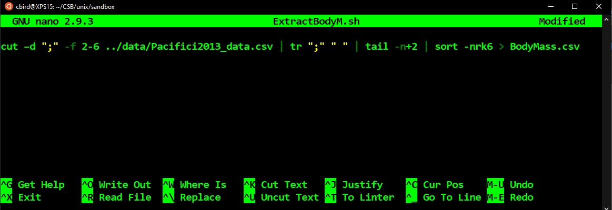
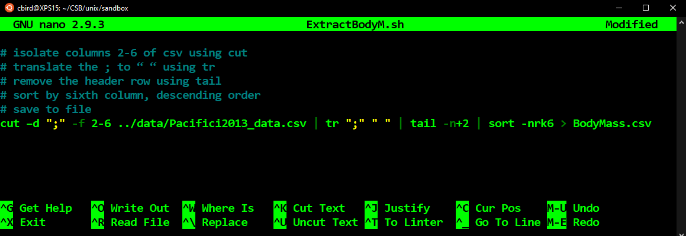
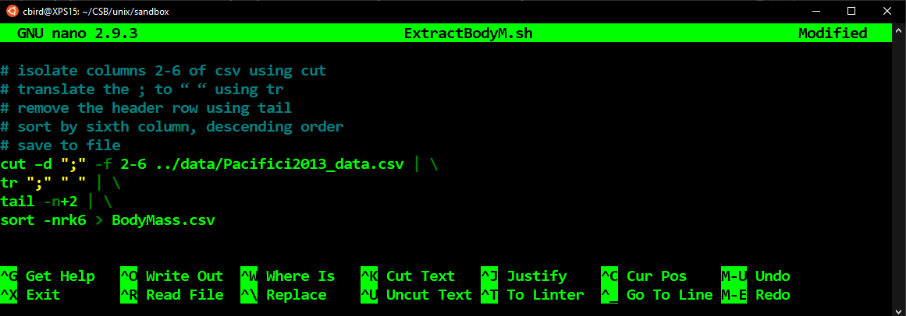
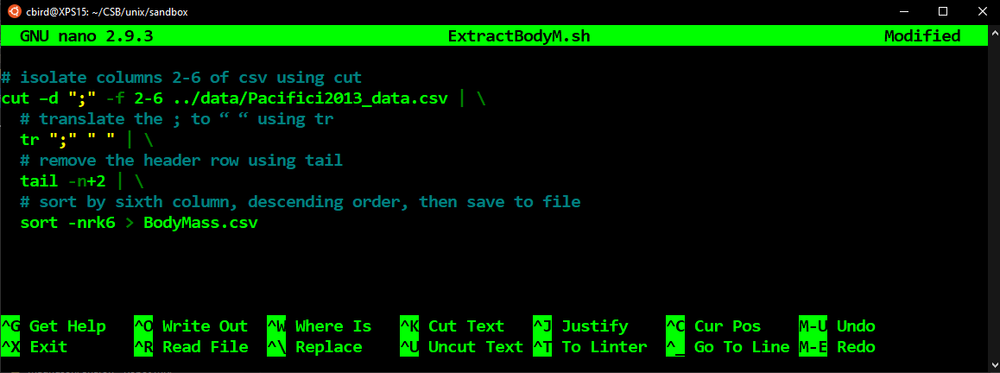
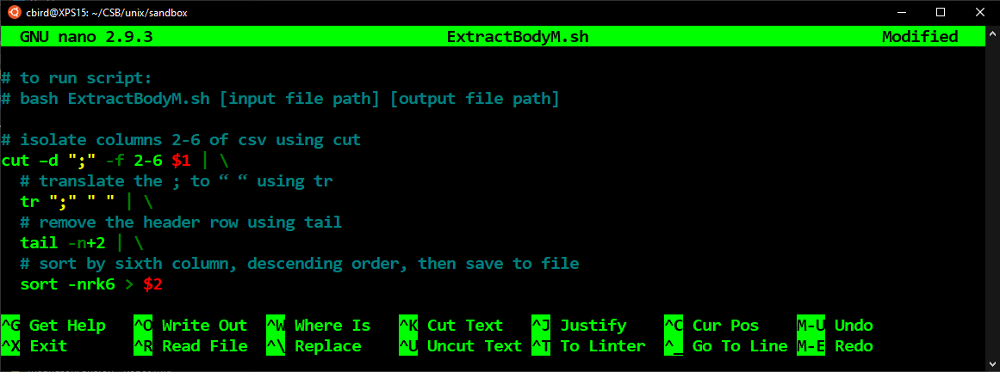
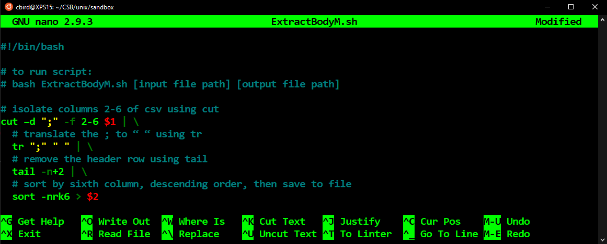
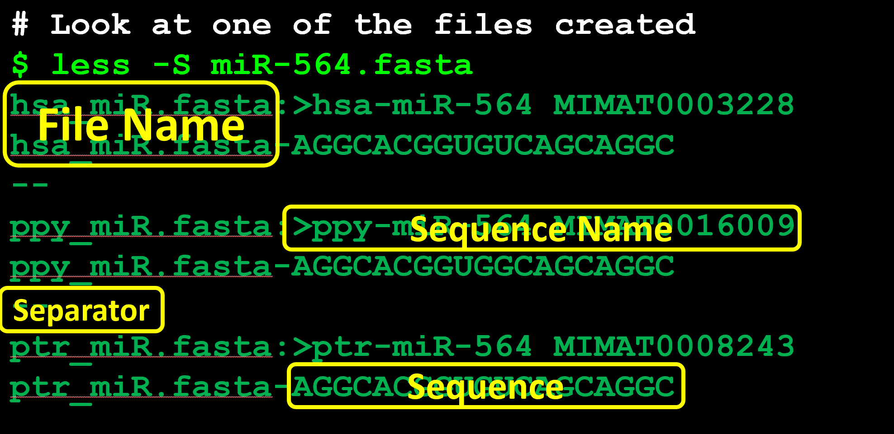
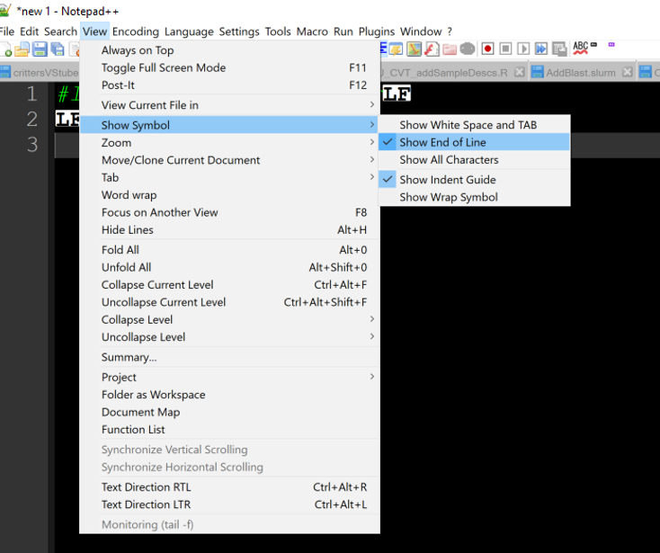
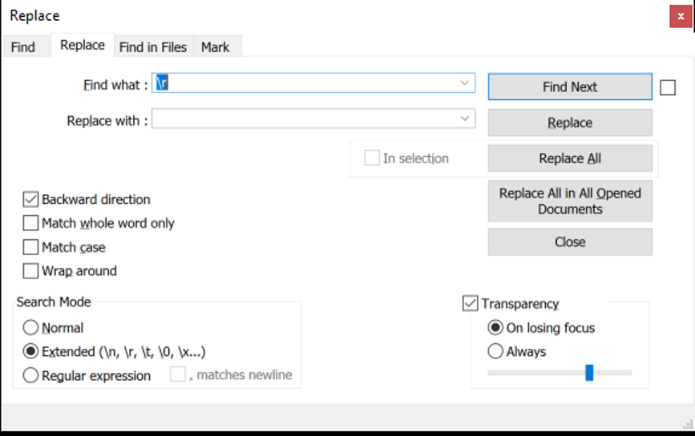
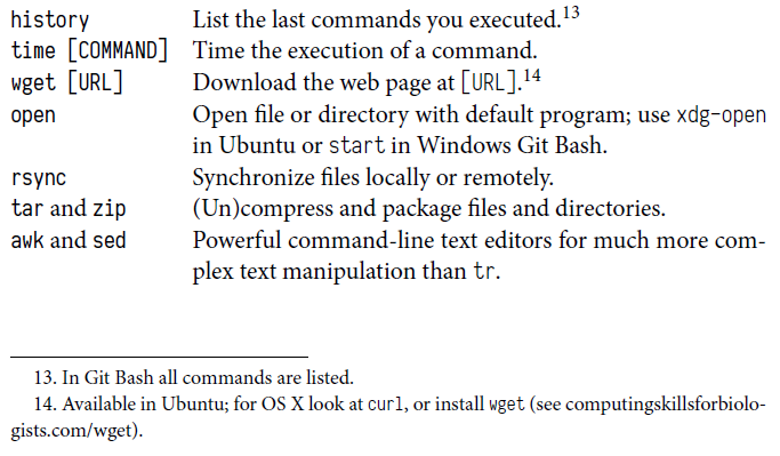

# Week02 UNIX II

### [Assignment 1](https://github.com/tamucc-comp-bio-2020/classroom_repo/blob/master/assignments/assignment_1.md) is due at the beginning of this lecture

## [Lecture 02 Slides](Week02_files/Lecture02_WelcomeToTheMatrix.pdf)

## Computer Preparation

You are expected to start each lecture with your terminal window open and ready to go.

<details><summary>Win10</summary>
<p>

  * If the Ubuntu app is not installed, then follow [these instructions](https://github.com/cbirdlab/wlsUBUNTU_settings/blob/master/InstallLinuxOnWindows_Automated.pdf)
  
  * Log into your Ubuntu terminal.  _We will not use `gitbash` unless you can not get Ubuntu running._ After logging in, You are in your home directory. 
  
  * If you are using an Ubuntu terminal that has not been setup (you will know because it will ask you to create a new user name and password) or you notice odd cursor behavior when editing text in the terminal, then run the following code:
  
    ```bash
    git clone https://github.com/cbirdlab/wlsUBUNTU_settings.git
    . ./wlsUBUNTU_settings/updateSettings.bash
    rm -rf wlsUBUNTU_settings
    ```
    
  * If the `CSB` directory does not exist in your home directory (check with `ls`), then run the following code to clone the `CSB` repository into your home directory:
  
    ```bash
    git clone https://github.com/CSB-book/CSB.git
    ```

  * It is always a good idea to keep your apps in `Ubuntu` up to date. _The first time you do this, it could take a long time to finish. After that, if you do this when you log in, it should go quickly._
    ```bash
    sudo apt update
    sudo apt upgrade
    ```

</p>
</details>

<details><summary>MacOS</summary>
<p>
 
  * Open a terminal window
  
  * Consider installing [homebrew](https://brew.sh/).  You will be able to use homebrew to install linux software, such as `tree`, which is used in the slide show.
  
  * If the `CSB` directory does not exist in your home directory (check with `ls`), then run the following code to clone the `CSB` repository into your home directory:
  
    ```bash
    git clone https://github.com/CSB-book/CSB.git
    ```
    
</p>
</details>


## Text Book Versus Online Materials

<details><summary>click to expand</summary>
<p>

The material below closely follow the book but there is some additional information that is not provided in the book (and vice versa). If you choose to follow the lecture slides, the `code blocks` are represented by green text on a black background, mimicking the terminal.

* Page 35 **Use _BodyMass.csv_ (slides) rather than _BodyM.csv_ (book)**

* Page 46, the script on the bottom half of the page is poor form. Making a bunch of tmp files is a bad idea.  Do this instead:

```
#!/bin/bash

# to run do this:
# ./ExtractBodyM.sh [infile] [outfile]

# isolate columns 2-6 of csv (first argument) using cut
# translate the ; to “ “ using tr
# remove the header row using tail
# sort by sixth column, descending order
# save to file (second argument)

# isolate columns 2-6 of csv (first argument) using cut
cut -d ";" -f 2-6 $1 | \
 # translate the ; to “ “ using tr
	tr ";" " " | \
 # remove the header row using tail
	tail -n+2 | \
 # sort by sixth column, descending order
 # save to file (second argument)
	sort -nrk6 > $2
```

</p>
</details>


## Concise Review of Materials Up Through Assignment 1

<details><summary>CLI Commands for Navigating and Manipulating Dirs & Files </summary>
<p>

* `cd`    change directories
* `pwd`   where am I?
* `ls`    show contents of `pwd`
* `cp`    copy files and directories from one location to another, could also rename copied file
* `mv`    move files and directories from one location to another, rename file or directories
* `rm`    delete file or dir, be careful, there is no undo
* `mkdir` make new directory, will not overwrite existing dir
* `less`  view a file without opening all of it, good for large files
* `nano`  word processor, edit text files
* `chmod` change file and dir permissions

</p>
</details>

<details><summary>*Commands* have *options* and accept *arguments* to Modify Functionality </summary>
<p>

### [command] [options] [arguments]

* `ls` is an example of a command

* `-a` single letter options are immediately preceded by `-`,  `- a` will not work

  * shortcut for many single letter options: `ls -l -t -r -h` is the same as `ls -ltrh`

* `--all` there are typically word versions of each option and they are preceded by `--`

  * there are no shortcuts for word options, i.e. `ls -ltrh --all` or ` ls --all -ltrh` or `ls -ltrha`

* an argument is a value or string that is provided to the command

  * ex. a path, dir name, or file name
  
  * `ls data` will return the file and contents of directory named *data* if it exists in present dir

Getting Help

  * `man` <command>    show manual for command
  
  * <command>` -h`     if man does not work, this could show manual for command
  
  * <command>` --help` another way to display manual in some cases
  
  * <command>          another way to display manual in some cases
  
  * use web browser to search on *bash command *
  
  * example of argument: `ls data` will return the file and contents of directory in pwd that are named *data* if they exist
  * example of option:  `ls -ltrh` will return all files in `pwd` with details, in reverse chronological order with human-readable file sizes

</p>
</details>

<details><summary>The Address of a File or Dir is a *Path*</summary>
<p>

The locations of files and dirs can be specified using *absolute* or *relative paths*, and these paths are used by the majority of commands because most commands manipulate files and dirs

Absolute paths specify the same address regardless of the present working dir

  * `/`     root dir, top dir in directory tree
  
  * `~`     home dir

Relative paths specify different addresses depending upon the present working dir

  * `-`     last directory your were in before the `pwd`
  
  * `../`   parent directory, one directory up the tree from `pwd`
  
  * `../../` 2 directories up the tree from `pwd`
  
  * `./`    present working directory

</p>
</details>

<details><summary>Wildcards</summary>
<p>

4. Wildcards can be used to specify several files with one word or paths

  * `*` can be any character
  * example: `ls *.txt` will list all files ending in `.txt` 

</p>
</details>

<details><summary>Manipulating Data Files</summary>
<p>

5. There are several commands in the text book that are important for manipulating biological data.

  * `echo`  prints text or convertes text into a text stream
  * `head`  returns only first few lines of a file, or remove last lines (rows)
  * `tail`  returns only last few lines of a file, or remove first lines (rows)
  * `cut`   returns specified columns
  * `cat`   combines files together by line (row)
  * `uniq`  removes duplicates
  * `sort`  changes the order of rows by column
  * `grep`  returns lines (rows) that match a pattern
  * `tr`    replaces one character with another, usually column delimiters
  * `wc`    count words, characters, lines, etc

</p>
</details>

<details><summary>Unix commands are designed to pipe `|` and redirect `>` text streams to construct pipelines that link commands and create new files</summary>
<p>

6. Unix commands are designed to pipe `|` and redirect `>` text streams to construct pipelines that link commands and create new files
  * `|`     takes standard output (*stdout*) from one command and pipes it to another command as *stdin*
  * `>`     redirects *stdout* into a file of your naming, will overwrite existing file
  * `>>`    redirects *stdout* into a file of your naming, will append existing file

</p>
</details>

<details><summary>The escape character `\ ` changes the meaning of the character that follows, including end of lines</summary>
<p>


7. The escape character `\ ` changes the meaning of the character that follows, including end of lines
  * at the end of a line, it means do not end line and continue on next line
  * `\t`   is a tab, but not all commands recognize this
  * `\n`   is a line feed (*LF*), the unix end of line character (usually invisible)
  * `\r`   is a carriage return (*CR*), in windows every line concludes with CRLF, and causes compatibility issues with unix/linux/mac 
  * there are MANY more uses of `\ `

</p>
</details>

<details><summary>We can assign values to variables</summary>
<p>


  ```bash
  VARIABLE=1375
  X=10
  height=6.3
  echo $VARIABLE $X $height
  ```
  
</p>
</details>


## Review of New Material Covered Prior to This Lecture (CSB Section 1.6) 

For the online version of this course, I converted the [**Lecture_02 Slides**](https://github.com/tamucc-comp-bio-2020/classroom_repo/blob/master/lectures/Week02_files/Lecture02_WelcomeToTheMatrix.pdf)  to a more screen-splitting friendly format here in GitHub.

<details><summary>Advanced `bash` Commands</summary>
<p>

### Redirection of output ([stdout](https://en.wikipedia.org/wiki/Standard_streams#Standard_output_(stdout))) to file `[command] > filename`
### Append [stdout](https://en.wikipedia.org/wiki/Standard_streams#Standard_output_(stdout)) to file `[command] >> filename` 
### Redirect contents of file to [stdin](https://en.wikipedia.org/wiki/Standard_streams#Standard_input_(stdin)) `[command] < filename` 

```bash
# let’s start by moving to our sandbox
$ cd ~/CSB/unix/sandbox

# print text to screen, then print to file, then print file to screen
$ echo "My first line" 
My first line

$ echo "My first line" > test.txt
$ cat test.txt
My first line

# append file with additional text, then print file to screen
$ echo "My second line" >> test.txt
$ cat test.txt
My first line
My second line
```


_use `Tab` key to autocomplete names, prevent spelling mistakes_

---

### Problem Solving Scenario

A machine provides you with thousands of data files. There’s so many, it is breaking your file browser. How many files are there?

We will use the dir `unix/data/Saavedra2013` as an example of a directory with many files

```bash
# start by moving to our sandbox if you are not already there
$ cd ~/CSB/unix/sandbox

# save file names to file in pwd
$ ls ../data/Saavedra2013 > filelist.txt

# look at the file
$ cat filelist.txt

# count lines in the file
$ wc -l filelist.txt

# remove the file
$ rm filelist.txt
```

---

### Piping Text Streams From One Command to the Next with `|`


A pipe `|` passes the [stdout](https://en.wikipedia.org/wiki/Standard_streams#Standard_output_(stdout)) from one command to the [stdin](https://en.wikipedia.org/wiki/Standard_streams#Standard_input_(stdin)) of another

How many files are there?

```bash
# list file names
$ ls ../data/Saavedra2013

# list file names and pipe into wc
$ ls ../data/Saavedra2013 | wc –l
59

```

---

### [TSV](https://en.wikipedia.org/wiki/Tab-separated_values) & [CSV](https://en.wikipedia.org/wiki/Comma-separated_values) Data Files

In the tidy table below, columns are _*delimited*_ by tabs.  The first column has no column header but is the sample ID.  Ozone, Solar.R, Wind, Temp, Month, and Day are all pieces of data (dimensions) describing each of the 10 samples.


* Tab Separated Values (TSV)

  * Tabs denote columns

* Comma Separated Values (CSV)

  * Commas denote columns
  
* [Tidy data](https://en.wikipedia.org/wiki/Tidy_data)

  * Each [row](https://en.wikipedia.org/wiki/Row_(database)) is one [unit of observation](https://en.wikipedia.org/wiki/Unit_of_observation)
  
  * Each [column](https://en.wikipedia.org/wiki/Column_(database)) is one dimension or aspect of the units of observation
  
* File extensions not always accurate, so it is important to view a file to be sure of the delimiter.

Do not type in the following code blocks.  They are here to show you TSV and CSV formatting


Tidy Table:
| Column 1 Header | Column 2 Header | Column 3 Header |
| --------------- | --------------- | --------------- |
| Row 1 Column 1 | Row 1 Column 2 | Row 1 Column 3 |
| Row 2 Column 1 | Row 2 Column 2 | Row 2 Column 3 |
| Row 3 Column 1 | Row 3 Column 2 | Row 3 Column 3 |
| Row 4 Column 1 | Row 4 Column 2 | Row 4 Column 3 |

TSV
```
Column 1 Header	Column 2 Header	Column 3 Header
Row 1 Column 1	Row 1 Column 2	Row 1 Column 3
Row 2 Column 1	Row 2 Column 2	Row 2 Column 3
Row 3 Column 1	Row 3 Column 2	Row 3 Column 3
Row 4 Column 1	Row 4 Column 2	Row 4 Column 3
```

TSV File with tabs denoted by `\t`.  Note your text files will not contain `\t`.  I did this show where tabs were, versus spaces.
```
Column 1 Header\tColumn 2 Header\tColumn 3 Header
Row 1 Column 1\tRow 1 Column 2\tRow 1 Column 3
Row 2 Column 1\tRow 2 Column 2\tRow 2 Column 3
Row 3 Column 1\tRow 3 Column 2\tRow 3 Column 3
Row 4 Column 1\tRow 4 Column 2\tRow 4 Column 3
```

CSV
```
Column 1 Header, Column 2 Header, Column 3 Header
Row 1 Column 1, Row 1 Column 2, Row 1 Column 3
Row 2 Column 1, Row 2 Column 2, Row 2 Column 3
Row 3 Column 1, Row 3 Column 2, Row 3 Column 3
Row 4 Column 1, Row 4 Column 2, Row 4 Column 3
```


---

### Convert Among Formats Using `tr "<old delimiter>" "<new delimiter>"`

```bash
# view contents of csv
$ less -S ../data/Pacifici2013_data.csv 

# replace semicolons with commas using tr [find] [replace]
$ cat ../data/Pacifici2013_data.csv | tr “;” “,” | less –S

# view as tsv
# \t is the nearly universal symbol for tab
$ cat ../data/Pacifici2013_data.csv | tr ";" "\t" | less -S

```

_`tr` is an abbreviation for translate_

---

### Using `cut` to retrieve columns and `head` to retrieve rows

```bash
# change directory
$ cd ~/CSB/unix/data

# display first line of file (i.e., header of CSV file)
$ head -n 1 Pacifici2013_data.csv

# display first column of file
$ cut -d ";" –f 1 Pacifici2013_data.csv

# display second through fourth columns
$ cut -d ";" -f 2-4 Pacifici2013_data.csv

# display first “cell” of data
$ head -n 1 Pacifici2013_data.csv | cut -d ";" -f 1

```

_Note: cut assumes tab delimited files.  If a different delimiter is used in the file, the `-d` option is used to specify the delimiter.  It is very easy to mistake spaces for tabs, and that will make `cut` do odd things with your data if you do not set `-d " "`_

---

### Connecting `cut` `head` `tail` `sort` `uniq`

```bash
# select 2nd column, display first 5 elements
$ cut -d ";" -f 2 Pacifici2013_data.csv | head -n 5

# select 2nd and 8th columns, display first 3 elements
$ cut -d ";" -f 2,8 Pacifici2013_data.csv | head -n 3

# select 2nd column without header, show 5 first elements
$ cut -d ";" -f 2 Pacifici2013_data.csv | tail -n +2 | head -n 5

# identify the orders in csv
# select 2nd column without header, unique sorted elements
$ cut -d ";" -f 2 Pacifici2013_data.csv | tail -n +2 | sort | uniq

# count how many records per order in csv
$ cut -d ";" -f 2 Pacifici2013_data.csv | tail -n +2 | sort | uniq -c

# output the order with the most records, including the number of records in csv
$ cut -d";" -f2 ../data/Pacifici2013_data.csv |  tail -n +2 | sort | uniq -c | tr -s " " "\t" | cut -f2-3 | sort -n | tail -n1


```

_Note: `uniq` is a command that that removes consecutive duplicate lines (rows). For this reason, the input to `uniq` is almost always sorted beforehand.  Use `man uniq` to see the description of the `-c` option.  I use `uniq -c` all the time._

_Note: `sort -t";"` specifies the delimiter character, also known as a field separator.  Try `man sort` and search `/field` to see the manual entry for this._

_Note: `tr -s` can be used to easily convert files or text streams that have multiple spaces in between columns (such as the output of `uniq -c` into a tab separated format.  The `-s` means squish consecutive charcters to one character_

---

### Advanced Pipelining

When constructing long pipelines like the last one in the code block above, you should build it step by step, testing the output as you go.  This strategy reduces the possibility of making a mistake.

I like to use `less -S` or `head` to capture and view the output when it takes up many lines.  The `q` key closes the `less` viewer.

```
# here is an example of how to build the really long pipe above, from scratch
$ cut -d";" -f2 ../data/Pacifici2013_data.csv | less -S
$ cut -d";" -f2 ../data/Pacifici2013_data.csv | tail -n +2 | head
$ cut -d";" -f2 ../data/Pacifici2013_data.csv | tail -n +2 | sort | head
$ cut -d";" -f2 ../data/Pacifici2013_data.csv | tail -n +2 | sort | uniq -c | less -S
$ cut -d";" -f2 ../data/Pacifici2013_data.csv | tail -n +2 | sort | uniq -c | tr -s " " "\t" | head
$ cut -d";" -f2 ../data/Pacifici2013_data.csv | tail -n +2 | sort | uniq -c | tr -s " " "\t" | cut -f2-3 | head
$ cut -d";" -f2 ../data/Pacifici2013_data.csv | tail -n +2 | sort | uniq -c | tr -s " " "\t" | cut -f2-3 | sort -n | less -S
$ cut -d";" -f2 ../data/Pacifici2013_data.csv | tail -n +2 | sort | uniq -c | tr -s " " "\t" | cut -f2-3 | sort -n | tail -n1
```

</p>
</details>


<details><summary>Additional Important Commands</summary>
<p>

### Substituting Characters Using 	`tr`
### Predefined Characters `[:upper:]`

`tr` can be used to replace one or more characters

```bash
# change all a to b
$ echo "aaaabbb" | tr "a" "b"
bbbbbbb

# change 1, 2, 3, 4, and 5 to zero
$ echo "123456789" | tr 1-5 0
000006789

# change a, c, t, g to upper case
$ echo "ACtGGcAaTT" | tr actg ACTG
ACTGGCAATT 

# change lower case letters to upper case
$ echo "ACtGGcAaTT" | tr [:lower:] [:upper:]
ACTGGCAATT

# change a, b, or c to 1, 2 ,or 3 repectively
$ echo "aabbccddee" | tr a-c 1-3
112233ddee

# delete all occurrences of a
$ echo "aaaaabbbb" | tr -d a
bbbb

# remove consecutive duplicate occurrences of a
$ echo "aaaaabbbb" | tr -s a
Abbbb

```

_Note: `tr` does not accept a file as an argument, always use pipe `|` or redirect a file into `tr` (`tr " " "," < file.txt`)_

---

### Use `;` to separate multiple independent commands on 1 line

`;` is equivalent to a period in an english sentence.

```bash
# move to sandbox and list files
cd ~/CSB/unix/sandbox; ls
```

---


### Making a New File From An Existing File

Make a new file `BodyMass.csv` in sandbox dir based on columns 2-6 in `Pacifici2013_data.csv`, remove header, sort lines according to body mass (large to small), change ; to spaces

```bash
# 1. View header row to refresh your memory
$ head -n 1 ../data/Pacifici2013_data.csv 
$ head -n 1 ../data/Pacifici2013_data.csv | tr ";" "\n"

# 2. Start building pipe, use head to view
$ cut -d ";" -f2-6 ../data/Pacifici2013_data.csv | head

# 3. Add to pipe by changing ; to tabs, use head to view
$ cut -d ";" -f2-6 ../data/Pacifici2013_data.csv | tr ";" "\t" | head

# 4. Add to pipe by removing first line, figure out sort options, use head to view
$ cut -d ";" -f2-6 ../data/Pacifici2013_data.csv | tr ";" " " | tail -n+2 | sort -nrk6 | head

# 5. Instead of piping to head, redirect output to file named BodyMass.csv
$ cut -d ";" -f2-6 ../data/Pacifici2013_data.csv | tr ";" " " | tail -n+2 | sort -nrk6 > BodyMass.csv
```

_Note: in step 1, we use `tr` to replace semicolons `;` with "[line feeds](https://en.wikipedia.org/wiki/Newline)" `\n` to view one column header per line._

_`\ ` is the "[escape character](https://en.wikipedia.org/wiki/Escape_character)".  What follows the `\ ` has an alternate meaning._
  * `t` is the letter "t", `\t` is a [metacharacter](https://en.wikipedia.org/wiki/Metacharacter) that symbolizes a tab
  * `n` is the letter "n", `\n` is a metacharacter that symbolizes the end of a line (aka line feed)

---

### [Wildcards](https://en.wikipedia.org/wiki/Wildcard_character) are Symbols that Represent Multiple Characters

`*` Matches zero or more characters, except "leading dot"

`?` Matches any single character, except "leading dot"

`[]` match any one of the characters in the brackets


```bash
# goto miRNA dir inside data dir
$ cd ~/CSB/unix/data/miRNA

# list all files that end with fasta 
$ ls *fasta

# count the numbers of lines in all the fasta files
$ wc -l *fasta

# print the first two lines of each file whose name starts with pp
$ head -n 2 pp*

# determine the type of every file that has an extension with exactly three letters
$ file *.???

# list all files begining with either g, h, or m and ending with fasta
ls [ghm]*fasta

```

_Note: in unix and linux, hidden files are marked by a "leading dot" `.`.  Try `ls -a` to see all files, including those that are hidden.  Wildcards will not return hidden files without being preceded by a `.` _

---

### Selecting lines with matching pattern using `grep [options] [pattern] <filename>` 

* Every line that matches the pattern is returned

  * there are options that allow more specific output, such as a word rather than a line

* Many options to increase functionality. I use `grep` all the time.

* [Regular Expressions](https://en.wikipedia.org/wiki/Regular_expression), aka regex, are used for pattern matching in text files

  * A language of characters, metacharacters, wildcards
  
  * 2 primary syntaxes or standards: [POSIX](https://en.wikipedia.org/wiki/POSIX) (default in `grep`), [Perl](https://en.wikipedia.org/wiki/Perl) (use `-P` option in `grep`)
  
    * when searching for help on regex, it is important to know which standard the pattern is using because POSIX is not the same a Perl


```bash
# goto unix chapter sandbox
$ cd ~/CSB/unix/sandbox

# how many wombats (fam Vombatidae)?
$ grep "Vombatidae" BodyMass.csv
$ grep -c "Vombatidae" BodyMass.csv

# which cattle are in file?
$ grep "Bos" BodyMass.csv

# Only match whole words
$ grep -w "Bos" BodyMass.csv

# Only match whole words and only return the words that match, rather than the lines
$ grep -wo "Bos" BodyMass.csv

# Make search case insensitive
$ grep –i "Bos" BodyMass.csv

# which mammals have body weight most similar to the gorilla?
# option –B lines before match, option –A lines after match
$ grep -B 2 -A 2 "Gorilla gorilla" BodyMass.csv

# show line number of gorilla
$ grep -n "Gorilla gorilla" BodyMass.csv

# -v means match anything except pattern
$ grep Gorilla BodyMass.csv | grep -v gorilla

# return all lines with Gorilla or Pan, note use of escape char \
$ grep -w "Gorilla\|Pan" BodyMass.csv

# return all lines with Gorilla for all files in data dir and its subdirs. -r recursive, searches subdirs
$ grep -r "Gorilla" ../data

```

_Note: the `grep -c` option is very handy for counting and can negate the need for `wc -l` _

---

### Searching for files with `find [dir] [options] [pattern]` 


```bash
# current directory is the unix sandbox
$ find ../data

# how many files are in data?
$ find ../data | wc -l

# find file named n30.txt in data
$ find ../data -name "n30.txt"

# use wildcards to find all files in data that contain about
$ find ../data -iname "*about*"

# count all files that end in .txt in data, then do same but do not include subdirs
$ find ../data -name "*.txt" | wc –l
$ find ../data -maxdepth 1 -name "*.txt" | wc –l

# count files in data that do not include about
$ find ../data -not -name "*about*" | wc -l

# find directories with data in path or name
$ find ../data -type d
```

---

### Change Permissions with `chmod [options] ### filename`

* Three types of permissions

  * Read, Write, Execute
  
  * Program will not run if `x` is not set

* Three types of users

  * User, Group, Global

* View with `ls -l`


* Setting permissions using “octal” numeric system

  * read = 4
  
  * write = 2
  
  * execute =1
  
  * Simply add numbers together for different combos of permissions

    * if the user has all permissions, 4 + 2 + 1 = 7
  
    * if the group has read permissions, 4
  
    * if the global has no permissions, 0

      * the full set of permissions are then: 740

```bash
# create a file in the unix sandbox
$ touch permissions.txt
$ ls –l

# change permissions so that user can r,w,x; group can r,x; and global can r
$ chmod 754 permissions.txt
$ ls –l

# give everybody full permissions 
$ chmod 777 permissions.txt
$ ls –l

# give yourself full permissions, but only let others read your files 
$ chmod 744 permissions.txt
$ ls –l
```

---

### Super User Do to Execute Command as Administrator: `sudo <command> <options> <arguments>`

* Use `sudo` when computer tells you no.
* Make sure you are certain that you are correct and computer is wrong to not execute your command.
* You will need sudo for installing software


```bash
$ apt update
Reading package lists... Done
E: Could not open lock file /var/lib/apt/lists/lock - open (13: Permission denied)
E: Unable to lock directory /var/lib/apt/lists/
W: Problem unlinking the file /var/cache/apt/pkgcache.bin - RemoveCaches (13: Permission denied)
W: Problem unlinking the file /var/cache/apt/srcpkgcache.bin - RemoveCaches (13: Permission denied)

$ sudo apt update

```

---

### Change Owners With `chown`

The user who creates a file or directory owns that file or directory, but sometimes you will want to transfer ownership (usually to yourself).

```bash
# create a directory with a subdirectory
$ mkdir -p test_dir/test_subdir
$ ls -l 
$ ls -l test_dir

# list valid users
$ cut –d: -f1 /etc/passwd

# change owner of dir, -R includes subdirs
$ chown -R ValidUserName test_dir/
$ sudo chown -R ValidUserName test_dir/
$ ls –l
$ ls –l test_dir

# change owner back to you
$ sudo chown -R $USER test_dir/
```

---


</p>
</details>

<details><summary>Assignment 1 Review</summary>
<p>

[Mind Expander 1.3 Form](https://forms.office.com/Pages/ResponsePage.aspx?id=8frLNKZngUepylFOslULZlFZdbyVx8RLiPt1GobhHnlUOThBNjZNVzlGQUtJUzhYREZVSE5UVVJMNS4u)

[Mind Expander 1.4](https://forms.office.com/Pages/ResponsePage.aspx?id=8frLNKZngUepylFOslULZlFZdbyVx8RLiPt1GobhHnlURVhQUzBWODVKR0VJTTE2WjlZN05ZTjhMRi4u)

[Exercise 1.10.1 Next Generation Sequencing Data](https://forms.office.com/Pages/ResponsePage.aspx?id=8frLNKZngUepylFOslULZlFZdbyVx8RLiPt1GobhHnlUMTVENFg0UjhFTzc3Wkc0NExRTjdLSjdGNi4u)

</p>
</details>

---


## New Material Covered During Lecture Today (CSB 1.7-1.9)

<details><summary>Scripting</summary>
<p>

See the lecture 2 slides and chapter 1 for this material

### What are [scripts](https://en.wikipedia.org/wiki/Scripting_language)?

A script is a file with a list of commands which are executed sequentially from the first line to the last.

In lecture 0, we installed [xming](https://sourceforge.net/projects/xming/) on windows computers.  You need to have [xming](https://sourceforge.net/projects/xming/) turned on for the next commands to work in Ubuntu on windows computers.  

```bash
# create and open ExtractBodyM.sh in CLI text editor
$ nano ExtractBodyM.sh

# ctrl + x to save and exit, then "y" to use the existing name, then "enter key"

# If you have Ubuntu, make sure that you have xming turned on
# open ExtractBodyM.sh in GUI text editor.  If this does not work, then use the nano command above
$ gedit ExtractBodyM.sh

# If you have Mac
# open ExtractBodyM.sh in GUI text editor.  If this does not work, then use the nano command above
$ open –a bbedit ExtractBodyM.sh
# or
$ open ExtractBodyM.sh
```

Either type in or copy and paste the pipeline we made previously to make `BodyMass.csv` into `ExtractBodyM.sh`:

```bash
cut -d ";" -f 2-6 ../data/Pacifici2013_data.csv | tr ";" " " | tail -n+2 | sort -nrk6 > BodyMass.csv
```

The script should look like this:



Close the script `ctrl + x` then run it as follows:

```bash
# run ExtractBodyM.sh script
$ bash ExtractBodyM.sh

# view directory
$ ls –ltrh

# Open script again
$ nano ExtractBodyM.sh
```

---

### Documenting your script appropriately

* It is important to write comments in English to describe what the script is doing

  * You’ll forget what the code does
  
  * Makes it easier for others to figure out what is happening in the script
  
  * Easier to identify errors

Add the following comments to the script before the code using nano

```bash
# isolate columns 2-6 of csv using cut
# translate the ; to “ “ using tr
# remove the header row using tail
# sort by sixth column, descending order
# save to file
```

Your screen in `nano` should look like this:



To save changes made in nano without closing: `ctrl + o`, then `enter`.  Do not change the name of the script

---

### Organizing the script

It can be a good idea to try to limit a script to 1 command per line to improve its readability.

Now, let us organize the script so that each pipe in the pipeline occurs on one line by adding the escape character `\ ` after each pipe `|` and hitting enter. The `\ ` tells `bash` to ignore the end of the line.  When complete, your screen should look like this:



Now that each command is on one line, we can reorganize the comments to occur immediately before the correct line, as follows:


_Note: `ctrl + k` will delete a line in `nano`_


---

### Indenting consistently

Indentation is a key to writing readable code.  Because we are continuing the same pipe, it is a good idea to indent the subsequent lines in the pipe, as follows:



---

### Accepting arguments from the command line

It is easy to write a script that accepts arguments when run from the command line.  Recall that an argument is a word or number that is passed to a command.  The first argument after a script or command is saved into a variable called `$1` automatically. A second argument is saved to `$2`, so on and so forth.  

Let us make our script accept a path to the input file and a path to the output file rather than [hard coding](https://en.wikipedia.org/wiki/Hard_coding) the input and output files. We do this by replacing the input `../data/Pacifici2013_data.csv` and output file paths `BodyMass.csv` with `$1` and `$2`, respectively. Do not forget to add to the documentation, and describe how the script should be run:



Do not forget to save your work with `ctrl + o`.

_Note: all variables are preceded by a `$`.  Avoid creating variables named 1, 2, etc because they could interfere with arguments read in from the command line._

---

### Running the script

Close `nano` with `ctrl + x`, then let us run the script.

```bash
# run ExtractBodyM.sh script
$ bash ExtractBodyM.sh ../data/Pacifici2013_data.csv BodyM.csv
```

---

### Making script "executable"

You can always run a bash script using `bash scriptname`, but you can also make the script executable so that you do not need to call `bash` to run the script.  The permissions need to be changed with `chmod`. Here we will give all users read, write, and execute priviledges. 

```bash
# change permissions so script is executable
$ chmod 777 ExtractBodyM.sh

# open script to add shebang!
$ nano ExtractBodyM.sh
```

Then, we need to add a [shebang!](https://en.wikipedia.org/wiki/Shebang_(Unix)) `#!`to the script. A shebang! tells the computer which program to run the script with, is always preceded by a `#!` and should be on the first line of the script.



Close `nano` and now you run the script as follows:

```bash
./ExtractBodyM.sh ../data/Pacifici2013_data.csv BodyM.csv
```

---

</p>
</details>


<details><summary>For Loops</summary>
<p>

### `for [variableName] in [list]; do [something]; done` 

* For loops automate repetitive tasks

  * 1 task, 100 files
  
  * Same task, many different arguments


```bash
$ cd ~/CSB/unix/data/miRNA
$ ls

# display first two lines of two fastas ( do not type in the > )
$ for file in ggo_miR.fasta hsa_miR.fasta
> do head -n 2 $file
> done
```

Let us break down the multiline `for` loop above.  

  * Line 1: `file` is the variable name.  
  
    * We could have named it anything but the CSB book uses `file`.  
	
    * I prefer to use `i`.  
  
  * Line 1: `ggo_miR.fasta hsa_miR.fasta` is the list
  
    * A list of file names
  
    * A list can also be the name of a file with a list inside of it
	
	* Or, a list can be a sequence of numbers, e.g. `seq 1 10`

  * Line 2: `head -n2 $file` is the command
  
    * return the first two lines of the file specified in `$file`
	
	* on the first cycle of the loop, `$file` is `ggo_miR.fasta`
	
  * Line 3: `done` tells the code to loop back to line 1 and make `file=hsa_miR.fasta`
  
    * The loop continues cycling until the whole list is complete.
	
	* this loop cycles twice because there are two file names in the list
	

Let us make a longer list of files using a wildcard

```bash
# display first two lines of all fastas
$ for i in *.fasta
> do head -n 2 $i
> done

```

_Note: When setting a variable equal to a value, don’t use a `$`. When calling the value held in the variable, use a `$`_

---

### Another `for` loop example

In the following for loop, we use a for loop to extract three types of microRNA from all of the `fasta` files and save them into 1 file per type of miRNA.

```bash
# display first two lines of two fastas
$ for miR in miR-208a miR-564 miR-3170
> do grep $miR -A1 *.fasta > $miR.fasta
> done
```



---

</p>
</details>


<details><summary>Tips & Tricks</summary>
<p>

### The `$PATH`

* A variable that holds all paths to directories where executable commands and scripts are located

* When you type `ls`, `bash` looks at `$PATH` to find the `ls` command file

* If you compile and install software manually (not with `apt`), you need to move it to a `$PATH` dir such as `/usr/local/bin`


```bash
# show path variable
$ echo $PATH

# identify the path to the ls command
$ which ls
/bin/ls
```

---

### Line Terminators - Use a Real Text Editor to View

* There are invisible characters at the end of every line in a text document

  * Carriage Return (CR or `\r`)
  
  * Line Feed (LF  or `\n`)
  
* Unix, Linux, Mac systems end lines with `LF`

* Win systems end lines with `CR LF`

* Make sure your remove CR from files made in Windows that will be used in Linux

* This is one of many reasons why we use a Notepad++ or BBedit

Showing line terminators in `Notepad ++`



Finding CR and replacing with nothing in `Notepad ++`



---

### Misc Useful Commands

Note that some of these commands need to be installed on MacOS using `brew`




</p>
</details>


## In Class Exercises
Complete the exercise(s) by answering the question(s) in the online form and submitting.  You must be logged into your TAMUCC email account to have your identity attached to your answers. 

You may work in groups, but each person must fill out the online answer form.

The exercises in the online forms closely follow those in the book.  I do make minor modifications and provide tips in the online form.  To ensure that your work is saved, **_I highly recommend that you first record your answers in a text document in either Notepad++ or BBedit and save them to your computer_**.  For an excellently formatted example, see the solutions provided by the book in `CSB/unix/solutions`. 

* [Exercise 1.10.2 Hormone Levels in Baboons](https://forms.office.com/Pages/ResponsePage.aspx?id=8frLNKZngUepylFOslULZlFZdbyVx8RLiPt1GobhHnlUQldJQTVHMTlYMFVYTkhZSDBZR1A0Q1E2Ny4u)

* [Exercise 1.10.3 Plant-Pollinator Networks](https://forms.office.com/Pages/ResponsePage.aspx?id=8frLNKZngUepylFOslULZlFZdbyVx8RLiPt1GobhHnlUMlpVSUQ0U1hTSFZERDE1WUdZWjRYUlhaWi4u)

## Homework NEED TO UPDATE
* [Assignment_2, Due 09/20](https://github.com/tamucc-comp-bio/fall_2019/blob/master/assignments/assignment_2.md)

