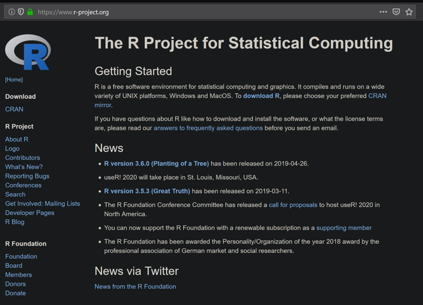

# Week05 R Boot Camp I: Statistical Computing Ch 8

###  Exam 1 is due by beginning of class

## Computer Preparation

You are expected to start each lecture with your terminal window open and ready to go.

<details><summary>Win10</summary>
<p>

  * If the Ubuntu app is not installed, then follow [these instructions](https://github.com/cbirdlab/wlsUBUNTU_settings/blob/master/InstallLinuxOnWindows_Automated.pdf)
  
  * Log into your Ubuntu terminal.  _We will not use `gitbash` unless you can not get Ubuntu running._ After logging in, You are in your home directory. 
  
  * If you are using an Ubuntu terminal that has not been setup (you will know because it will ask you to create a new user name and password) or you notice odd cursor behavior when editing text in the terminal, then run the following code:
  
    ```bash
    git clone https://github.com/cbirdlab/wlsUBUNTU_settings.git
    . ./wlsUBUNTU_settings/updateSettings.bash
    rm -rf wlsUBUNTU_settings
    ```
    
  * If the `CSB` directory does not exist in your home directory (check with `ls`), then run the following code to clone the `CSB` repository into your home directory:
  
    ```bash
    git clone https://github.com/CSB-book/CSB.git
    ```

  * It is always a good idea to keep your apps in `Ubuntu` up to date. _The first time you do this, it could take a long time to finish. After that, if you do this when you log in, it should go quickly._
    ```bash
    sudo apt update
    sudo apt upgrade
    ```

</p>
</details>

<details><summary>MacOS</summary>
<p>
 
  * Open a terminal window
  
  * Consider installing [homebrew](https://brew.sh/).  You will be able to use homebrew to install linux software, such as `tree`, which is used in the slide show.
  
  * If the `CSB` directory does not exist in your home directory (check with `ls`), then run the following code to clone the `CSB` repository into your home directory:
  
    ```bash
    git clone https://github.com/CSB-book/CSB.git
    ```
    
</p>
</details>

___


## [I. Lecture Slides](Week05new_files/Introduction%20to%20R%201.pptx)

## II. Lecture Activities 

### Install R & RStudio (If you haven't already)

1. [R](https://cran.revolutionanalytics.com/)

2. [RStudio](https://rstudio.com/products/rstudio/download/?utm_source=downloadrstudio&utm_medium=Site&utm_campaign=home-hero-cta#download)


---

### What is R?

R is a statistical computing language



* Free
* Open source
* Popular among biologists
* Almost any analysis is available for free
* Easy to use
* Flexible
* Command line interface
* Linux, Win, Mac

---

### Running R from terminal


## III. Mind Expanders

[Mind Expander 8.1](https://forms.office.com/Pages/ResponsePage.aspx?id=8frLNKZngUepylFOslULZlFZdbyVx8RLiPt1GobhHnlUMFpONVRLSkNYUU9VQ1RXVzhGODBPTFM1UC4u)

[Mind Expander 8.2](https://forms.office.com/Pages/ResponsePage.aspx?id=8frLNKZngUepylFOslULZlFZdbyVx8RLiPt1GobhHnlURDZQWkY5U1VSWU84WDU5Sk1HWE80NjdVVy4u)

[Mind Expander 8.3](https://forms.office.com/Pages/ResponsePage.aspx?id=8frLNKZngUepylFOslULZlFZdbyVx8RLiPt1GobhHnlUQTRGOTA5UDRZMzlPSjEwTUxCVzBIOEdKRi4u)

[Mind Expander 8.4](https://forms.office.com/Pages/ResponsePage.aspx?id=8frLNKZngUepylFOslULZlFZdbyVx8RLiPt1GobhHnlUMlRGTE9aQVQ3QUtBQlBOUEtHN1g3QUVDOS4u)

[Mind Expander 8.5](https://forms.office.com/Pages/ResponsePage.aspx?id=8frLNKZngUepylFOslULZlFZdbyVx8RLiPt1GobhHnlUMlIwMFNWME1IUVJCWktXWkZYSk1RV0pONC4u)

---


## HOMEWORK

TBA

